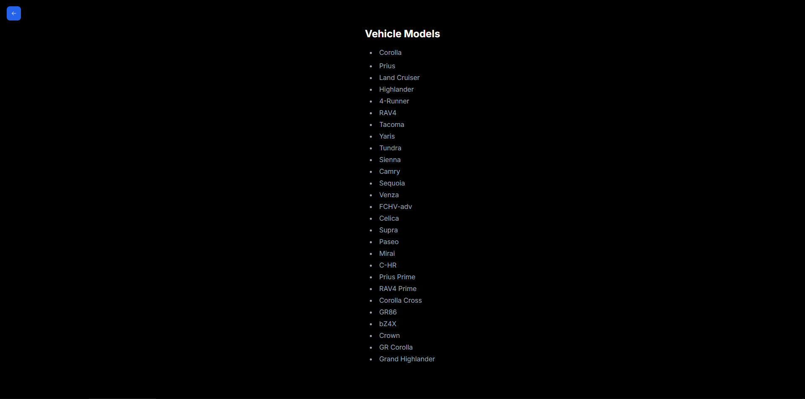

# Car Dealer App

<p>
  
</p>

## Description

The Car Dealer App is a web application built with Next.js and Tailwind CSS that allows users to filter vehicles by type and model year. It provides a user-friendly interface to view vehicle models based on selected criteria.

## Features

- **Filter Vehicles**: Users can filter vehicles by type and model year.
- **Dynamic Pages**: Each combination of vehicle type and year has its own page.
- **Responsive Design**: Styled using Tailwind CSS for a modern, responsive interface.

## Technologies

- **Next.js**: Framework for server-side rendering and static site generation.
- **Tailwind CSS**: Utility-first CSS framework for styling.
- **React Suspense**: For handling loading states.

## Instruccions to run this project locally.

```javascript
npm install
```

```javascript
npm start
```

### See the project at http://localhost:3000/
